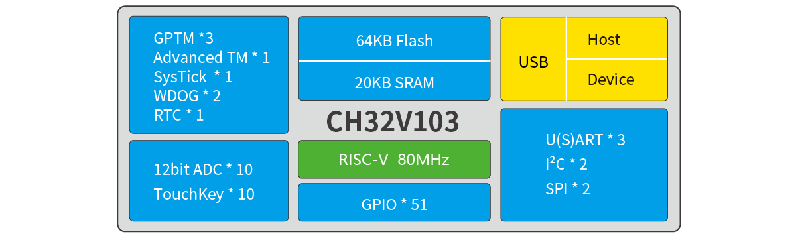
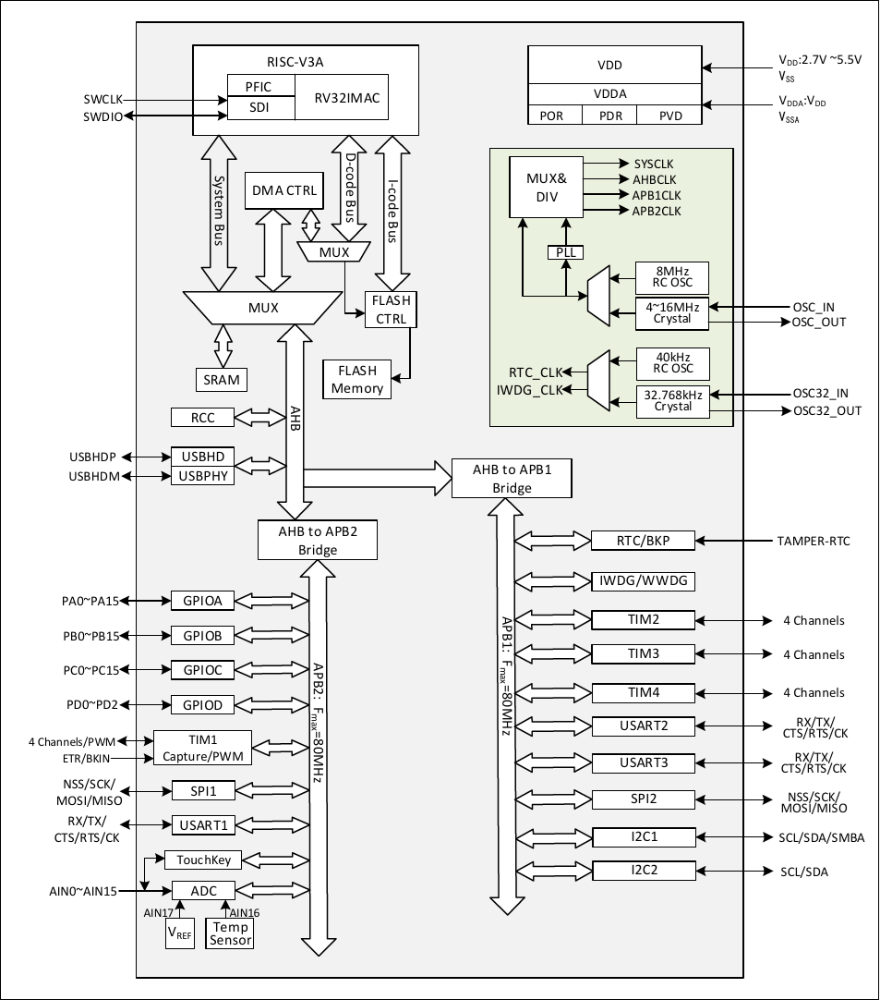

# CH32V103

| SWCLK | SWDIO | TX1 | RX1  | TX2 | RX2 | TX3  | RX3  |
|-------|-------|-----|------|-----|-----|------|------|
| PA14  | PA13  | PA9 | PA10 | PA2 | PA3 | PB10 | PB11 |

## Official Site

- https://www.wch-ic.com/products/CH32V103.html
- https://www.wch.cn/products/CH32V103.html

## System Block Diagram

## System Architecture

## Comparison
<table>
    <thead>
        <tr>
            <th colspan="2">Product No.</th>
            <th>CH32V103C6T6</th>
            <th>CH32V103C8T6</th>
            <th>CH32V103C8U6</th>
            <th>CH32V103R8T6</th>
        </tr>
    </thead>
    <tbody align="center">
        <tr>
            <td colspan="2">Pin count</td>
            <td>48</td>
            <td>48</td>
            <td>48</td>
            <td>64</td>
        </tr>
        <tr>
            <td colspan="2">Flash memory (byte)</td>
            <td>32K</td>
            <td>64K</td>
            <td>64K</td>
            <td>64K</td>
        </tr>
        <tr>
            <td colspan="2">SRAM (byte)</td>
            <td>10K</td>
            <td>20K</td>
            <td>20K</td>
            <td>20K</td>
        </tr>
        <tr>
            <td colspan="2">Number of GPIOs</td>
            <td>37</td>
            <td>37</td>
            <td>37</td>
            <td>51</td>
        </tr>
        <tr>
            <td rowspan="4">Timer</td>
            <td>General-purpose</td>
            <td>2</td>
            <td>3</td>
            <td>3</td>
            <td>3</td>
        </tr>
        <tr>
            <td>Advanced</td>
            <td>1</td>
            <td>1</td>
            <td>1</td>
            <td>1</td>
        </tr>
        <tr>
            <td>Watchdog (WDT)</td>
            <td>2</td>
            <td>2</td>
            <td>2</td>
            <td>2</td>
        </tr>
        <tr>
            <td>SysTick</td>
            <td>1</td>
            <td>1</td>
            <td>1</td>
            <td>1</td>
        </tr>
        <tr>
            <td colspan="2">ADC/TKey (Number of channels)</td>
            <td>10</td>
            <td>10</td>
            <td>10</td>
            <td>16</td>
        </tr>
        <tr>
            <td rowspan="4">Communication Interface</td>
            <td>SPI</td>
            <td>1</td>
            <td>2</td>
            <td>2</td>
            <td>2</td>
        </tr>
        <tr>
            <td>I2C</td>
            <td>1</td>
            <td>2</td>
            <td>2</td>
            <td>2</td>
        </tr>
        <tr>
            <td>USART</td>
            <td>2</td>
            <td>3</td>
            <td>3</td>
            <td>3</td>
        </tr>
        <tr>
            <td>USBHD 2.0FS</td>
            <td>1</td>
            <td>1</td>
            <td>1</td>
            <td>1</td>
        </tr>
        <tr>
            <td colspan="2">CPU clock frequency</td>
            <td colspan="4">Typical: 72MHz</td>
        </tr>
        <tr>
            <td colspan="2">Operating voltage</td>
            <td colspan="4">2.7V~5.5V</td>
        </tr>
        <tr>
            <td colspan="2">Operating temperature</td>
            <td colspan="4">Industrial grade -40℃~85℃</td>
        </tr>
        <tr>
            <td colspan="2">Package</td>
            <td colspan="2">LQFP48</td>
            <td>QFN48×7</td>
            <td>LQFP64M(10*10)</td>
        </tr>
    </tbody>
</table>

## Pin Definitions
<table width="100%">
    <thead>
        <tr>
            <th colspan="3"> Pin No.</th>
            <th rowspan="2">Pin Name</th>
            <th rowspan="2">PinType</th>
            <th rowspan="2">Mainfunction (after reset)</th>
            <th rowspan="2">Defaultalternate function</th>
            <th rowspan="2">Remapping function</th>
        </tr>
        <tr>
            <th>LQFP 48</th>
            <th>QFN 48×7</th>
            <th>LQFP 64M</th>
        </tr>
    </thead>
    <tbody align="center">
        <tr>
            <td>10</td>
            <td>10</td>
            <td>14</td>
            <td>PA0-WKUP</td>
            <td>I/O/A</td>
            <td>PA0</td>
            <td>WKUP/ USART2_CTS/ ADC_IN0/ TIM2_CH1/ TIM2_ETR</td>
            <td></td>
        </tr>
        <tr>
            <td>11</td>
            <td>11</td>
            <td>15</td>
            <td>PA1</td>
            <td>I/O/A</td>
            <td>PA1</td>
            <td>USART2_RTS/ ADC_IN1/ TIM2_CH2</td>
            <td></td>
        </tr>
        <tr>
            <td>12</td>
            <td>12</td>
            <td>16</td>
            <td>PA2</td>
            <td>I/O/A</td>
            <td>PA2</td>
            <td>USART2_TX/ ADC_IN2/ TIM2_CH3</td>
            <td></td>
        </tr>
        <tr>
            <td>13</td>
            <td>13</td>
            <td>17</td>
            <td>PA3</td>
            <td>I/O/A</td>
            <td>PA3</td>
            <td>USART2_RX/ ADC_IN3/  TIM2_CH4</td>
            <td></td>
        </tr>
        <tr>
            <td>14</td>
            <td>14</td>
            <td>20</td>
            <td>PA4</td>
            <td>I/O/A</td>
            <td>PA4</td>
            <td>SPI1_NSS/ USART2_CK/ ADC_IN4</td>
            <td></td>
        </tr>
        <tr>
            <td>15</td>
            <td>15</td>
            <td>21</td>
            <td>PA5</td>
            <td>I/O/A</td>
            <td>PA5</td>
            <td>SPI1_SCK/ ADC_IN5</td>
            <td></td>
        </tr>
        <tr>
            <td>16</td>
            <td>16</td>
            <td>22</td>
            <td>PA6</td>
            <td>I/O/A</td>
            <td>PA6</td>
            <td>SPI1_MISO/ ADC_IN6/ TIM3_CH1</td>
            <td>TIM1_BKIN_1</td>
        </tr>
        <tr>
            <td> 17</td>
            <td>17</td>
            <td>23</td>
            <td>PA7</td>
            <td>I/O/A</td>
            <td>PA7</td>
            <td>SPI1_MOSI/ ADC_IN7/ TIM3_CH2</td>
            <td>TIM1_CH1N_1</td>
        </tr>
        <tr>
            <td>29</td>
            <td>29</td>
            <td>41</td>
            <td>PA8</td>
            <td>I/O</td>
            <td>PA8</td>
            <td>USART1_CK/ TIM1_CH1/ MCO</td>
            <td></td>
        </tr>
        <tr>
            <td>30</td>
            <td>30</td>
            <td>42</td>
            <td>PA9</td>
            <td>I/O</td>
            <td>PA9</td>
            <td>USART1_TX/ TIM1_CH2</td>
            <td></td>
        </tr>
        <tr>
            <td>31</td>
            <td>31</td>
            <td>43</td>
            <td>PA10</td>
            <td>I/O</td>
            <td>PA10</td>
            <td>USART1_RX/ TIM1_CH3</td>
            <td></td>
        </tr>
        <tr>
            <td>32</td>
            <td>32</td>
            <td>44</td>
            <td>PA11</td>
            <td>I/O/A</td>
            <td>PA11</td>
            <td>USART1_CTS/ USBHDM/ TIM1_CH4</td>
            <td></td>
        </tr>
        <tr>
            <td>33</td>
            <td>33</td>
            <td>45</td>
            <td>PA12</td>
            <td>I/O/A</td>
            <td>PA12</td>
            <td>USART1_RTS/ USBHDP/ TIM1_ETR</td>
            <td></td>
        </tr>
        <tr>
            <td>34</td>
            <td>34</td>
            <td>46</td>
            <td>PA13</td>
            <td>I/O</td>
            <td>SWDIO</td>
            <td></td>
            <td>PA13</td>
        </tr>
        <tr>
            <td>37</td>
            <td>37</td>
            <td>49</td>
            <td>PA14</td>
            <td>I/O</td>
            <td>SWCLK</td>
            <td></td>
            <td>PA14</td>
        </tr>
        <tr>
            <td>38</td>
            <td>38</td>
            <td>50</td>
            <td>PA15</td>
            <td>I/O</td>
            <td>PA15</td>
            <td></td>
            <td>TIM2_CH1_1/ TIM2_ETR_1/ SPI1_NSS_1</td>
        </tr>
        <tr>
            <td>18</td>
            <td>18</td>
            <td>26</td>
            <td>PB0</td>
            <td>I/O/A</td>
            <td>PB0</td>
            <td>ADC_IN8/ TIM3_CH3</td>
            <td>TIM1_CH2N_1</td>
        </tr>
        <tr>
            <td>19</td>
            <td>19</td>
            <td>27</td>
            <td>PB1</td>
            <td>I/O/A</td>
            <td>PB1</td>
            <td>ADC_IN9/ TIM3_CH4</td>
            <td>TIM1_CH3N_1</td>
        </tr>
        <tr>
            <td>20</td>
            <td>20</td>
            <td>28</td>
            <td>PB2</td>
            <td>I/O</td>
            <td>PB2/BOOT1</td>
            <td></td>
            <td></td>
        </tr>
        <tr>
            <td>39</td>
            <td>39</td>
            <td>55</td>
            <td>PB3</td>
            <td>I/O</td>
            <td>PB3</td>
            <td></td>
            <td>TIM2_CH2_1/ SPI1_SCK_1</td>
        </tr>
        <tr>
            <td>40</td>
            <td>40</td>
            <td>56</td>
            <td>PB4</td>
            <td>I/O</td>
            <td>PB4</td>
            <td></td>
            <td>TIM3_CH1_1/ SPI1_MISO_1</td>
        </tr>
        <tr>
            <td> 41</td>
            <td>41</td>
            <td>57</td>
            <td>PB5</td>
            <td>I/O</td>
            <td>PB5</td>
            <td>I2C1_SMBAI</td>
            <td>TIM3_CH2_1/ SPI1_MOSI_1</td>
        </tr>
        <tr>
            <td>42</td>
            <td>42</td>
            <td>58</td>
            <td>PB6</td>
            <td>I/O/A</td>
            <td>PB6</td>
            <td>I2C1_SCL/ TIM4_CH1</td>
            <td>USART1_TX_1</td>
        </tr>
        <tr>
            <td>43</td>
            <td>43</td>
            <td>59</td>
            <td>PB7</td>
            <td>I/O/A</td>
            <td>PB7</td>
            <td>I2C1_SDA/ TIM4_CH2</td>
            <td>USART1_RX_1</td>
        </tr>
        <tr>
            <td>45</td>
            <td>45</td>
            <td>61</td>
            <td>PB8</td>
            <td>I/O/A</td>
            <td>PB8</td>
            <td>TIM4_CH3</td>
            <td>I2C1_SCL_1</td>
        </tr>
        <tr>
            <td>46</td>
            <td>46</td>
            <td>62</td>
            <td>PB9</td>
            <td>I/O/A</td>
            <td>PB9</td>
            <td>TIM4_CH4</td>
            <td>I2C1_SDA_1</td>
        </tr>
        <tr>
            <td>21</td>
            <td>21</td>
            <td>29</td>
            <td>PB10</td>
            <td>I/O</td>
            <td>PB10</td>
            <td>I2C2_SCL/ USART3_TX</td>
            <td>TIM2_CH3_1</td>
        </tr>
        <tr>
            <td>22</td>
            <td>22</td>
            <td>30</td>
            <td>PB11</td>
            <td>I/O</td>
            <td>PB11</td>
            <td>I2C2_SDA/ USART3_RX</td>
            <td>TIM2_CH4_1</td>
        </tr>
        <tr>
            <td>25</td>
            <td>25</td>
            <td>33</td>
            <td>PB12</td>
            <td>I/O</td>
            <td>PB12</td>
            <td>SPI2_NSS/ I2C2_SMBAI/ USART3_CK/ TIM1_BKIN</td>
            <td></td>
        </tr>
        <tr>
            <td>26</td>
            <td>26</td>
            <td>34</td>
            <td>PB13</td>
            <td>I/O</td>
            <td>PB13</td>
            <td>SPI2_SCK/ USART3_CTS/ TIM1_CH1N</td>
            <td></td>
        </tr>
        <tr>
            <td>27</td>
            <td>27</td>
            <td>35</td>
            <td>PB14</td>
            <td>I/O</td>
            <td>PB14</td>
            <td>SPI2_MISO/ USART3_RTS/ TIM1_CH2N </td>
            <td></td>
        </tr>
        <tr>
            <td>28</td>
            <td>28</td>
            <td>36</td>
            <td>PB15</td>
            <td>I/O</td>
            <td>PB15</td>
            <td>SPI2_MOSI/ TIM1_CH3N</td>
            <td></td>
        </tr>
        <tr>
            <td>-</td>
            <td>-</td>
            <td>8</td>
            <td>PC0</td>
            <td>I/O/A</td>
            <td>PC0</td>
            <td>ADC_IN10</td>
            <td></td>
        </tr>
        <tr>
            <td>-</td>
            <td>-</td>
            <td>9</td>
            <td>PC1</td>
            <td>I/O/A</td>
            <td>PC1</td>
            <td>ADC_IN11</td>
            <td></td>
        </tr>
        <tr>
            <td>-</td>
            <td>-</td>
            <td>10</td>
            <td>PC2</td>
            <td>I/O/A</td>
            <td>PC2</td>
            <td>ADC_IN12</td>
            <td></td>
        </tr>
        <tr>
            <td>-</td>
            <td>-</td>
            <td>11</td>
            <td>PC3</td>
            <td>I/O/A</td>
            <td>PC3</td>
            <td>ADC_IN13</td>
            <td></td>
        </tr>
        <tr>
            <td>-</td>
            <td>-</td>
            <td>24</td>
            <td>PC4</td>
            <td>I/O/A</td>
            <td>PC4</td>
            <td>ADC_IN14</td>
            <td></td>
        </tr>
        <tr>
            <td>-</td>
            <td>-</td>
            <td>25</td>
            <td>PC5</td>
            <td>I/O/A</td>
            <td>PC5</td>
            <td>ADC_IN15</td>
            <td></td>
        </tr>
        <tr>
            <td>-</td>
            <td>-</td>
            <td>37</td>
            <td>PC6</td>
            <td>I/O</td>
            <td>PC6</td>
            <td></td>
            <td>TIM3_CH1_1</td>
        </tr>
        <tr>
            <td>-</td>
            <td>-</td>
            <td>38</td>
            <td>PC7</td>
            <td>I/O</td>
            <td>PC7</td>
            <td></td>
            <td>TIM3_CH2_1</td>
        </tr>
        <tr>
            <td>-</td>
            <td>-</td>
            <td>39</td>
            <td>PC8</td>
            <td>I/O</td>
            <td>PC8</td>
            <td></td>
            <td>TIM3_CH3_1</td>
        </tr>
        <tr>
            <td>-</td>
            <td>-</td>
            <td>40</td>
            <td>PC9</td>
            <td>I/O</td>
            <td>PC9</td>
            <td></td>
            <td>TIM3_CH4_1</td>
        </tr>
        <tr>
            <td>-</td>
            <td>-</td>
            <td>51</td>
            <td>PC10</td>
            <td>I/O</td>
            <td>PC10</td>
            <td></td>
            <td>USART3_TX_1</td>
        </tr>
        <tr>
            <td>-</td>
            <td>-</td>
            <td>52</td>
            <td>PC11</td>
            <td>I/O</td>
            <td>PC11</td>
            <td></td>
            <td>USART3_RX_1</td>
        </tr>
        <tr>
            <td>-</td>
            <td>-</td>
            <td>53</td>
            <td>PC12</td>
            <td>I/O</td>
            <td>PC12</td>
            <td></td>
            <td>USART3_CK_1</td>
        </tr>
        <tr>
            <td>2</td>
            <td>2</td>
            <td>2</td>
            <td>PC13-TAMPERRTC</td>
            <td>I/O</td>
            <td>PC13</td>
            <td>TAMPER-RTC</td>
            <td></td>
        </tr>
        <tr>
            <td>3</td>
            <td>3</td>
            <td>3</td>
            <td>PC14-OSC32_IN</td>
            <td>I/O/A</td>
            <td>PC14</td>
            <td>OSC32_IN</td>
            <td></td>
        </tr>
        <tr>
            <td>4</td>
            <td>4</td>
            <td>4</td>
            <td>PC15-OSC32_OUT</td>
            <td>I/O/A</td>
            <td>PC15</td>
            <td>OSC32_OUT</td>
            <td></td>
        </tr>
        <tr>
            <td>5</td>
            <td>5</td>
            <td>5</td>
            <td>OSC_IN</td>
            <td>I/A</td>
            <td>OSC_IN</td>
            <td></td>
            <td>PD0</td>
        </tr>
        <tr>
            <td>6</td>
            <td>6</td>
            <td>6</td>
            <td>OSC_OUT</td>
            <td>O/A</td>
            <td>OSC_OUT</td>
            <td></td>
            <td>PD1</td>
        </tr>
        <tr>
            <td>-</td>
            <td>-</td>
            <td>54</td>
            <td>PD2</td>
            <td>I/O</td>
            <td>PD2</td>
            <td>TIM3_ETR</td>
            <td></td>
        </tr>
        <tr>
            <td>1</td>
            <td>1</td>
            <td>1</td>
            <td>VBAT</td>
            <td>P</td>
            <td>VBAT</td>
            <td></td>
            <td></td>
        </tr>
        <tr>
            <td>7</td>
            <td>7</td>
            <td>7</td>
            <td>NRST</td>
            <td>I/O</td>
            <td>NRST</td>
            <td></td>
            <td></td>
        </tr>
        <tr>
            <td>8</td>
            <td>8</td>
            <td>12</td>
            <td>VSSA</td>
            <td>P</td>
            <td>VSSA</td>
            <td></td>
            <td></td>
        </tr>
        <tr>
            <td>9</td>
            <td>9</td>
            <td>13</td>
            <td>VDDA</td>
            <td>P</td>
            <td>VDDA</td>
            <td></td>
            <td></td>
        </tr>
        <tr>
            <td>-</td>
            <td>-</td>
            <td>18</td>
            <td>VSS_4</td>
            <td>P</td>
            <td>VSS_4</td>
            <td></td>
            <td></td>
        </tr>
        <tr>
            <td>-</td>
            <td>-</td>
            <td>19</td>
            <td>VDD_4</td>
            <td>P</td>
            <td>VDD_4</td>
            <td></td>
            <td></td>
        </tr>
        <tr>
            <td>23</td>
            <td>23</td>
            <td>31</td>
            <td>VSS_1</td>
            <td>P</td>
            <td>VSS_1</td>
            <td></td>
            <td></td>
        </tr>
        <tr>
            <td>24</td>
            <td>24</td>
            <td>32</td>
            <td>VDD_1</td>
            <td>P</td>
            <td>VDD_1</td>
            <td></td>
            <td></td>
        </tr>
        <tr>
            <td>35</td>
            <td>35</td>
            <td>47</td>
            <td>VSS_2</td>
            <td>P</td>
            <td>VSS_2</td>
            <td></td>
            <td></td>
        </tr>
        <tr>
            <td>36</td>
            <td>36</td>
            <td>48</td>
            <td>VDD_2</td>
            <td>P</td>
            <td>VDD_2</td>
            <td></td>
            <td></td>
        </tr>
        <tr>
            <td>44</td>
            <td>44</td>
            <td>60</td>
            <td>BOOT0</td>
            <td>I</td>
            <td>BOOT0</td>
            <td></td>
            <td></td>
        </tr>
        <tr>
            <td>47</td>
            <td>47</td>
            <td>63</td>
            <td>VSS_3</td>
            <td>P</td>
            <td>VSS_3</td>
            <td></td>
            <td></td>
        </tr>
        <tr>
            <td>48</td>
            <td>48</td>
            <td>64</td>
            <td>VDD_3</td>
            <td>P</td>
            <td>VDD_3</td>
            <td></td>
            <td></td>
        </tr>
    </tbody>
</table>
