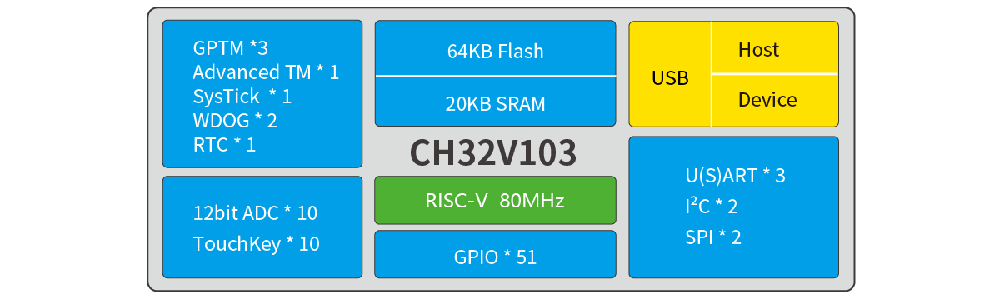
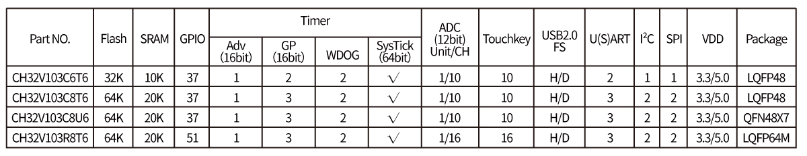
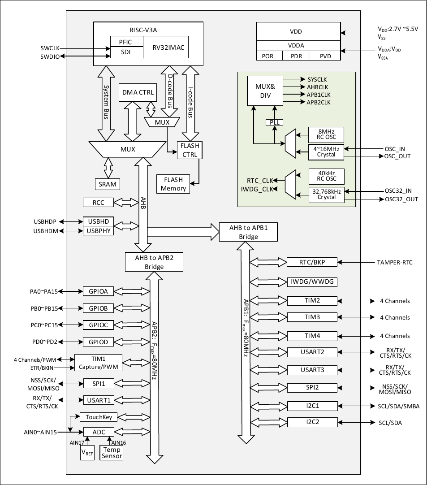

# CH32V103
| SWCLK | SWDIO | TX1 | RX1  | TX2 | RX2 | TX3  | RX3  |
|-------|-------|-----|------|-----|-----|------|------|
| PA14  | PA13  | PA9 | PA10 | PA2 | PA3 | PB10 | PB11 |

## Official Site
- https://www.wch-ic.com/products/CH32V103.html
- https://www.wch.cn/products/CH32V103.html

## System Block Diagram

### CH32V103

## GPIO Definitions
<table>
    <thead>
        <tr>
            <th>CH32V103 C6T6 (LQFP48)</th>
            <th>CH32V103 C8T6 (LQFP48)</th>
            <th>CH32V103 C8U6 (QFN48X7)</th>
            <th>CH32V103 R8T6 (LQFP64M)</th>
            <th>Pin name</th>
            <th>Pin type</th>
            <th>Main function (after reset)</th>
            <th>Note</th>
        </tr>
    </thead>
    <tbody align="center">
        <tr>
            <td>10</td>
            <td>10</td>
            <td>10</td>
            <td>14</td>
            <td>PA0-WKUP</td>
            <td>I/O/A</td>
            <td>PA0</td>
            <td></td>
        </tr>
        <tr>
            <td>11</td>
            <td>11</td>
            <td>11</td>
            <td>15</td>
            <td>PA1</td>
            <td>I/O/A</td>
            <td>PA1</td>
            <td></td>
        </tr>
        <tr>
            <td>12</td>
            <td>12</td>
            <td>12</td>
            <td>16</td>
            <td>PA2</td>
            <td>I/O/A</td>
            <td>PA2</td>
            <td>TX2</td>
        </tr>
        <tr>
            <td>13</td>
            <td>13</td>
            <td>13</td>
            <td>17</td>
            <td>PA3</td>
            <td>I/O/A</td>
            <td>PA3</td>
            <td>RX2</td>
        </tr>
        <tr>
            <td>14</td>
            <td>14</td>
            <td>14</td>
            <td>20</td>
            <td>PA4</td>
            <td>I/O/A</td>
            <td>PA4</td>
            <td></td>
        </tr>
        <tr>
            <td>15</td>
            <td>15</td>
            <td>15</td>
            <td>21</td>
            <td>PA5</td>
            <td>I/O/A</td>
            <td>PA5</td>
            <td></td>
        </tr>
        <tr>
            <td>16</td>
            <td>16</td>
            <td>16</td>
            <td>22</td>
            <td>PA6</td>
            <td>I/O/A</td>
            <td>PA6</td>
            <td></td>
        </tr>
        <tr>
            <td> 17</td>
            <td>17</td>
            <td>17</td>
            <td>23</td>
            <td>PA7</td>
            <td>I/O/A</td>
            <td>PA7</td>
            <td></td>
        </tr>
        <tr>
            <td>29</td>
            <td>29</td>
            <td>29</td>
            <td>41</td>
            <td>PA8</td>
            <td>I/O</td>
            <td>PA8</td>
            <td></td>
        </tr>
        <tr>
            <td>30</td>
            <td>30</td>
            <td>30</td>
            <td>42</td>
            <td>PA9</td>
            <td>I/O</td>
            <td>PA9</td>
            <td>TX1</td>
        </tr>
        <tr>
            <td>31</td>
            <td>31</td>
            <td>31</td>
            <td>43</td>
            <td>PA10</td>
            <td>I/O</td>
            <td>PA10</td>
            <td>RX1</td>
        </tr>
        <tr>
            <td>32</td>
            <td>32</td>
            <td>32</td>
            <td>44</td>
            <td>PA11</td>
            <td>I/O/A</td>
            <td>PA11</td>
            <td></td>
        </tr>
        <tr>
            <td>33</td>
            <td>33</td>
            <td>33</td>
            <td>45</td>
            <td>PA12</td>
            <td>I/O/A</td>
            <td>PA12</td>
            <td></td>
        </tr>
        <tr>
            <td>34</td>
            <td>34</td>
            <td>34</td>
            <td>46</td>
            <td>PA13</td>
            <td>I/O</td>
            <td>SWDIO</td>
            <td>SWDIO</td>
        </tr>
        <tr>
            <td>37</td>
            <td>37</td>
            <td>37</td>
            <td>49</td>
            <td>PA14</td>
            <td>I/O</td>
            <td>SWCLK</td>
            <td>SWCLK</td>
        </tr>
        <tr>
            <td>38</td>
            <td>38</td>
            <td>38</td>
            <td>50</td>
            <td>PA15</td>
            <td>I/O</td>
            <td>PA15</td>
            <td></td>
        </tr>
        <tr>
            <td>18</td>
            <td>18</td>
            <td>18</td>
            <td>26</td>
            <td>PB0</td>
            <td>I/O/A</td>
            <td>PB0</td>
            <td></td>
        </tr>
        <tr>
            <td>19</td>
            <td>19</td>
            <td>19</td>
            <td>27</td>
            <td>PB1</td>
            <td>I/O/A</td>
            <td>PB1</td>
            <td></td>
        </tr>
        <tr>
            <td>20</td>
            <td>20</td>
            <td>20</td>
            <td>28</td>
            <td>PB2</td>
            <td>I/O</td>
            <td>PB2/BOOT1</td>
            <td></td>
        </tr>
        <tr>
            <td>39</td>
            <td>39</td>
            <td>39</td>
            <td>55</td>
            <td>PB3</td>
            <td>I/O</td>
            <td>PB3</td>
            <td></td>
        </tr>
        <tr>
            <td>40</td>
            <td>40</td>
            <td>40</td>
            <td>56</td>
            <td>PB4</td>
            <td>I/O</td>
            <td>PB4</td>
            <td></td>
        </tr>
        <tr>
            <td> 41</td>
            <td>41</td>
            <td>41</td>
            <td>57</td>
            <td>PB5</td>
            <td>I/O</td>
            <td>PB5</td>
            <td></td>
        </tr>
        <tr>
            <td>42</td>
            <td>42</td>
            <td>42</td>
            <td>58</td>
            <td>PB6</td>
            <td>I/O/A</td>
            <td>PB6</td>
            <td></td>
        </tr>
        <tr>
            <td>43</td>
            <td>43</td>
            <td>43</td>
            <td>59</td>
            <td>PB7</td>
            <td>I/O/A</td>
            <td>PB7</td>
            <td></td>
        </tr>
        <tr>
            <td>45</td>
            <td>45</td>
            <td>45</td>
            <td>61</td>
            <td>PB8</td>
            <td>I/O/A</td>
            <td>PB8</td>
            <td></td>
        </tr>
        <tr>
            <td>46</td>
            <td>46</td>
            <td>46</td>
            <td>62</td>
            <td>PB9</td>
            <td>I/O/A</td>
            <td>PB9</td>
            <td></td>
        </tr>
        <tr>
            <td>21</td>
            <td>21</td>
            <td>21</td>
            <td>29</td>
            <td>PB10</td>
            <td>I/O</td>
            <td>PB10</td>
            <td>TX3</td>
        </tr>
        <tr>
            <td>22</td>
            <td>22</td>
            <td>22</td>
            <td>30</td>
            <td>PB11</td>
            <td>I/O</td>
            <td>PB11</td>
            <td>RX3</td>
        </tr>
        <tr>
            <td>25</td>
            <td>25</td>
            <td>25</td>
            <td>33</td>
            <td>PB12</td>
            <td>I/O</td>
            <td>PB12</td>
            <td></td>
        </tr>
        <tr>
            <td>26</td>
            <td>26</td>
            <td>26</td>
            <td>34</td>
            <td>PB13</td>
            <td>I/O</td>
            <td>PB13</td>
            <td></td>
        </tr>
        <tr>
            <td>27</td>
            <td>27</td>
            <td>27</td>
            <td>35</td>
            <td>PB14</td>
            <td>I/O</td>
            <td>PB14</td>
            <td></td>
        </tr>
        <tr>
            <td>28</td>
            <td>28</td>
            <td>28</td>
            <td>36</td>
            <td>PB15</td>
            <td>I/O</td>
            <td>PB15</td>
            <td></td>
        </tr>
        <tr>
            <td>-</td>
            <td>-</td>
            <td>-</td>
            <td>8</td>
            <td>PC0</td>
            <td>I/O/A</td>
            <td>PC0</td>
            <td></td>
        </tr>
        <tr>
            <td>-</td>
            <td>-</td>
            <td>-</td>
            <td>9</td>
            <td>PC1</td>
            <td>I/O/A</td>
            <td>PC1</td>
            <td></td>
        </tr>
        <tr>
            <td>-</td>
            <td>-</td>
            <td>-</td>
            <td>10</td>
            <td>PC2</td>
            <td>I/O/A</td>
            <td>PC2</td>
            <td></td>
        </tr>
        <tr>
            <td>-</td>
            <td>-</td>
            <td>-</td>
            <td>11</td>
            <td>PC3</td>
            <td>I/O/A</td>
            <td>PC3</td>
            <td></td>
        </tr>
        <tr>
            <td>-</td>
            <td>-</td>
            <td>-</td>
            <td>24</td>
            <td>PC4</td>
            <td>I/O/A</td>
            <td>PC4</td>
            <td></td>
        </tr>
        <tr>
            <td>-</td>
            <td>-</td>
            <td>-</td>
            <td>25</td>
            <td>PC5</td>
            <td>I/O/A</td>
            <td>PC5</td>
            <td></td>
        </tr>
        <tr>
            <td>-</td>
            <td>-</td>
            <td>-</td>
            <td>37</td>
            <td>PC6</td>
            <td>I/O</td>
            <td>PC6</td>
            <td></td>
        </tr>
        <tr>
            <td>-</td>
            <td>-</td>
            <td>-</td>
            <td>38</td>
            <td>PC7</td>
            <td>I/O</td>
            <td>PC7</td>
            <td></td>
        </tr>
        <tr>
            <td>-</td>
            <td>-</td>
            <td>-</td>
            <td>39</td>
            <td>PC8</td>
            <td>I/O</td>
            <td>PC8</td>
            <td></td>
        </tr>
        <tr>
            <td>-</td>
            <td>-</td>
            <td>-</td>
            <td>40</td>
            <td>PC9</td>
            <td>I/O</td>
            <td>PC9</td>
            <td></td>
        </tr>
        <tr>
            <td>-</td>
            <td>-</td>
            <td>-</td>
            <td>51</td>
            <td>PC10</td>
            <td>I/O</td>
            <td>PC10</td>
            <td></td>
        </tr>
        <tr>
            <td>-</td>
            <td>-</td>
            <td>-</td>
            <td>52</td>
            <td>PC11</td>
            <td>I/O</td>
            <td>PC11</td>
            <td></td>
        </tr>
        <tr>
            <td>-</td>
            <td>-</td>
            <td>-</td>
            <td>53</td>
            <td>PC12</td>
            <td>I/O</td>
            <td>PC12</td>
            <td></td>
        </tr>
        <tr>
            <td>2</td>
            <td>2</td>
            <td>2</td>
            <td>2</td>
            <td>PC13 TAMPER RTC</td>
            <td>I/O</td>
            <td>PC13</td>
            <td></td>
        </tr>
        <tr>
            <td>3</td>
            <td>3</td>
            <td>3</td>
            <td>3</td>
            <td>PC14 OSC32_IN</td>
            <td>I/O/A</td>
            <td>PC14</td>
            <td></td>
        </tr>
        <tr>
            <td>4</td>
            <td>4</td>
            <td>4</td>
            <td>4</td>
            <td>PC15 OSC32_OUT</td>
            <td>I/O/A</td>
            <td>PC15</td>
            <td></td>
        </tr>
        <tr>
            <td>5</td>
            <td>5</td>
            <td>5</td>
            <td>5</td>
            <td>OSC_IN</td>
            <td>I/A</td>
            <td>OSC_IN</td>
            <td>not available</td>
        </tr>
        <tr>
            <td>6</td>
            <td>6</td>
            <td>6</td>
            <td>6</td>
            <td>OSC_OUT</td>
            <td>O/A</td>
            <td>OSC_OUT</td>
            <td>not available</td>
        </tr>
        <tr>
            <td>-</td>
            <td>-</td>
            <td>-</td>
            <td>54</td>
            <td>PD2</td>
            <td>I/O</td>
            <td>PD2</td>
            <td></td>
        </tr>
    </tbody>
</table>

## System Architecture

